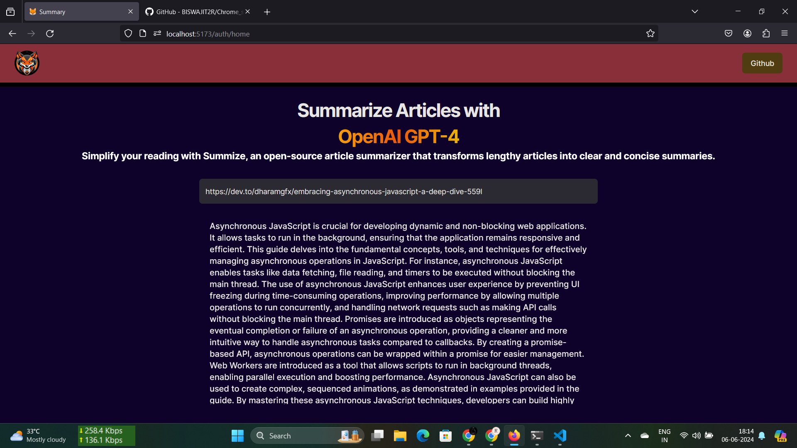

Here is the corrected version of your text:

---

# A SUMMARY APP USING CHATGPT

The main task of the app is to summarize an entire article in a minimum of 200 words. In this web app, we have two layers: 1. Auth and 2. Use the App.

# To use this app, you need to sign in. Here, I provide you with some bypass credentials:
- Email: mrbiswajitdas2000@gmail.com
- Password: 123456789

# Here, I show my app's home page.

# Tech Stack
1. Vite + React + TypeScript
2. Authentication, login, sign-up validation, and design using:
   - Zod and Shadcn

# This is under development. In the future, we plan to add new features, such as search, summary storage in the database, and real-time login using email and phone number.

# You can work with me on this project.